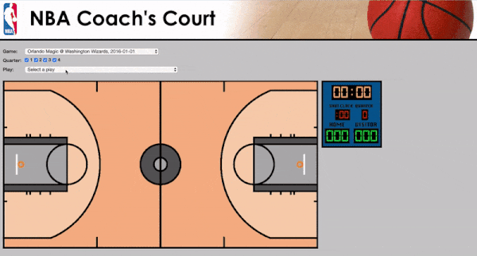

# SportVU_D3
This repository contains code for the ingestion, cleaning, and visualization of NBA SportVU data. This visualization portion of the repository was used as my final project for DATS 6401 - Visualization of Complex Data.

This uses d3.js (and other Javascript), Django, PostgreSQL, HTML, CSS, and more. The web app looks like this:

In addition, the same datasets (SportVU and play-by-play data) were used in my capstone project, also in this repository. The goal of the project was to use these datasets to find ways to improve strategy in half-court offense. The presentation and report for this project are in [capstone/](./capstone/).

Many attempts at using neural networks and other methods to help perform unsupervised clustering (as well as predict points scored) of half-court offensive possessions are in [model_build/](./model_build/). In the end, the method that was most successful at clustering the possessions was time series clustering using dynamic time warping distance, using the [tslearn](https://github.com/rtavenar/tslearn) library. The code used for this is in the [ts_clustering.ipynb](./ts_clustering.ipynb) notebook.

SportVU data from [this repository](https://github.com/neilmj/BasketballData), play-by-play data was pulled from NBA's stats API ([here](https://github.com/swar/nba_api) is a library that I used to pull it)
